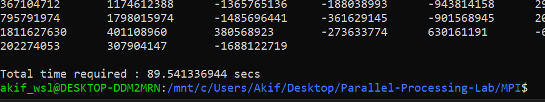
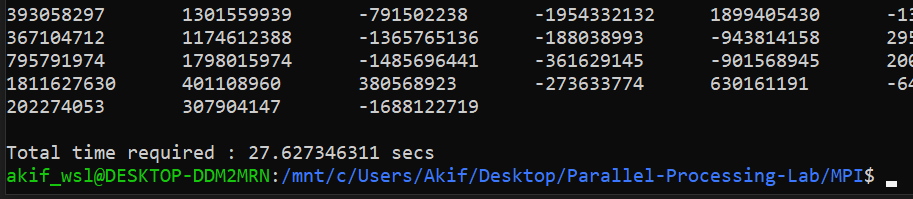
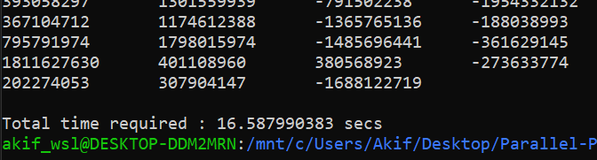

# Parallel Processing & Distributed System
<p>
<h4> Akif Islam<br>
Department of CSE, University of Rajshahi, <br>
Email: iamakifislam@gmail.com
</p>

## Matrix Multiplication with MPI
For two matrices, A (400x500) and B (500x300), the multiplication operation performed 500 times. The below is the result of execution time by using various processors.

### 1 Processor --> 89.54 seconds
```bash
mpiexec -np 1 ./MPI_Matrix_Multiplication 500 400 500 300
```


### 4 Processors --> 27.62 seconds
```bash
mpiexec -np 4 ./MPI_Matrix_Multiplication 500 400 500 300
```


### 10 Processors --> 16.58 seconds
```bash
mpiexec -np 10 ./MPI_Matrix_Multiplication 500 400 500 300
```



